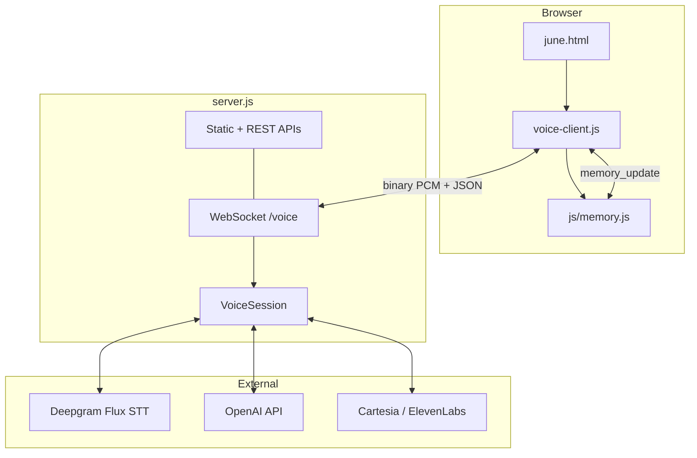
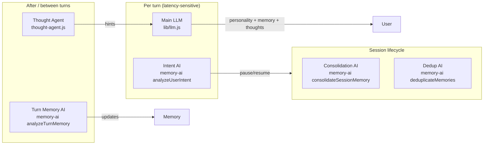

# June — Architecture

June is an ultra-low-latency, full-duplex voice agent: the browser streams microphone audio to a Node.js backend, which orchestrates speech-to-text, LLM reasoning, text-to-speech, and persistent memory. The user talks naturally; June responds in voice with barge-in (interrupt) support and speculative turn completion for faster replies.

This document is the onboarding map for humans and AI agents working in the repo.

---

## Quick start

```bash
npm install
cp .env.example .env   # add API keys
npm start              # http://localhost:3000
```

Open the page and click the orb (or press `m`) to start a voice session. Memory persists in the browser via `localStorage`.

| Key | Purpose |
| --- | --- |
| `DEEPGRAM_API_KEY` | STT (Deepgram Flux) |
| `OPENAI_API_KEY` | Main LLM, memory AI, thought agent |
| `CARTESIA_API_KEY` or `ELEVENLABS_API_KEY` | Server-side TTS (optional; browser TTS fallback exists) |

---

## Repository layout

```
June/
├── server.js              # HTTP server, REST APIs, WebSocket /voice
├── june.html              # Single-page UI shell
├── aichr_2.md             # June's personality / system prompt (loaded by lib/states.js)
├── .env.example           # Environment variable reference
│
├── lib/                   # Server-side modules (ES modules, Node ≥18.17)
│   ├── states.js          # Config, State enum, FluxEvent enum, SYSTEM_PROMPT
│   ├── session.js         # VoiceSession — core orchestrator & state machine
│   ├── sttFlux.js         # Deepgram Flux WebSocket client
│   ├── llm.js             # OpenAI streaming chat + greeting generation
│   ├── tts.js             # Cartesia / ElevenLabs TTS + stall markers
│   ├── memory.js          # Memory v2 schema, retrieval, prompt injection
│   ├── memory-ai.js       # Turn analysis, consolidation, deduplication
│   ├── thought-agent.js   # Background associative “thoughts” for the main LLM
│   └── functions.js       # Session control: pause, resume, sleep
│
├── js/                    # Browser scripts (IIFEs, no bundler)
│   ├── voice-client.js    # WebSocket, mic capture, TTS playback, UI events
│   ├── memory.js          # localStorage persistence (window.JuneMemory)
│   ├── index.js           # (empty placeholder)
│   └── ui.js              # (empty placeholder)
│
├── css/index.css          # App styles
└── md/
    ├── PIPELINE.md        # Voice pipeline deep dive
    └── STT-PIPELINE.md    # STT / Flux / mic capture details
```

---

## High-level architecture



**Data ownership**

- **Conversation history** — held in `VoiceSession.history` on the server for the active WebSocket session; mirrored client-side in `voice-client.js` (`clientHistory`) for display only.
- **Long-term memory** — authoritative store is browser `localStorage` (`june_memory`). Server analyzes and mutates memory in RAM, then pushes updates via `memory_update` messages; client persists with `JuneMemory.applyFromServer()`.

---

## Voice pipeline (one turn)

```
Mic (float32) → resample to 16k Int16 → WebSocket binary → FluxStream
                                                              ↓ TurnInfo events
                                                         VoiceSession
                                                              ↓ EndOfTurn / EagerEndOfTurn
                                                    analyzeUserIntent (memory-ai)
                                                              ↓
                                                    streamReply (llm) — speculative or confirmed
                                                              ↓ token deltas
                                                    TTS speak (Cartesia/ElevenLabs) or text-only
                                                              ↓ PCM f32 @ 24k
WebSocket binary [4-byte turnId | PCM] → browser gapless playback
```

### Speculative execution (latency optimization)

Deepgram Flux emits `EagerEndOfTurn` before a final `EndOfTurn`. June starts the LLM early on eager EOT but **buffers tokens without TTS** until the final transcript confirms the same text. If the user resumes speaking (`TurnResumed`), the speculative draft is aborted.

### Barge-in

On `StartOfTurn` while June is speaking: abort LLM (`AbortController`), cancel TTS context, send `interrupt` to client, flush scheduled audio buffers. Client tags each PCM chunk with `turnId` and ignores stragglers after interrupt.

### Stall markers

The LLM may emit `{-gap:N-}` markers in text. `lib/memory.js` injects these for natural pauses; `lib/tts.js` prepends silence to the next audio chunk. Display strips them via `stripStallMarkers()`. Toggle visibility in dev with `Cmd/Ctrl+Shift+G`.

---

## State machine

Defined in `lib/states.js` as `State`:

| State | Meaning |
| --- | --- |
| `IDLE` | No active STT connection |
| `LISTENING` | Mic open, waiting for user speech |
| `THINKING` | LLM streaming (may be speculative) |
| `SPEAKING` | TTS audio playing or assistant text streaming |
| `PAUSED` | User asked to pause; mic still streams but turns are ignored until resume |

Transitions are driven by Flux turn events, generation lifecycle, and session functions (`pause` / `resume` / `sleep`).

---

## Module reference

### `server.js`

- Serves static files (`june.html`, `js/`, `css/`).
- **REST endpoints** (see [HTTP API](#http-api)).
- **WebSocket** at `/voice`: creates one `VoiceSession` per connection.
  - Binary messages → `session.handleAudio()`
  - JSON messages → `init`, `text`, `resume`, `set_tts_provider`

### `lib/session.js` — `VoiceSession`

The central orchestrator. Owns:

- STT (`FluxStream`), TTS instance, conversation `history`, `memory`, `context`
- Generation object (`gen`) per turn: `AbortController`, speculative flag, TTS controller, buffers
- Thought agent scheduling (debounced on partial transcripts)
- Memory sync after each assistant turn (`#syncMemoryToClient`)
- Session consolidation on close or sleep (`#consolidateAndSend`)

Key private methods: `#processUserTurn`, `#beginGeneration`, `#consume` (LLM stream), `#emitDelta`, `#finalize`, `#abortGeneration`.

### `lib/sttFlux.js` — `FluxStream`

WebSocket client to `wss://api.deepgram.com/v2/listen` with model `flux-general-en`, linear16 @ 16kHz. Emits `turn` events with `FluxEvent` types. Pre-buffers audio until the socket is open.

### `lib/llm.js`

- `streamReply()` — async generator over OpenAI Chat Completions (`stream: true`).
- `generateGreeting()` — one-shot greeting when the page loads (also exposed as `/api/greeting`).
- Builds system prompt from: `aichr_2.md` + memory instructions + conversation rhythm + thought hints.

Models: `OPENAI_MODEL` (default `gpt-4o-mini`), temperature `MAIN_TEMPERATURE`.

### `lib/tts.js`

- `createTTS(provider)` → `CartesiaTTS` or `ElevenLabsTTS` (WebSocket streaming).
- `provider === "browser"` → server returns `null` TTS; client uses `speechSynthesis` on `speakFallback`.
- Each generation uses context id `gen-{turnId}`.

### `lib/memory.js` — Memory v2

Tiered schema (`version: 2`):

| Tier | Storage | Role |
| --- | --- | --- |
| `identity` | `{ name, age, ... }` | Permanent core facts |
| `semantic` | `[]` of categorized facts | Long-term knowledge (preference, relationship, etc.) |
| `episodic` | `[]` of session summaries | Consolidated session recaps |
| `logs` | `[]` of transient observations | Short-lived; may promote on consolidation |
| `meta` | session ids, counts, timestamps | Bookkeeping |

Important exports:

- `retrieveRelevantMemories()` — scored retrieval within `MEMORY_TOKEN_BUDGET`
- `buildMemoryInstructions()` / `buildMemoryEngagement()` — injected into LLM system prompt
- `applyMemoryUpdates()` — applies memory-ai JSON to the in-memory object
- `mergeCleanDelta()` / `injectAutoGaps()` — stream parsing, memory tags, stall injection
- `consolidateSession()` — moves session logs into episodic summary

Limits: 100 logs, 20 episodic, 200 semantic (trimmed by importance/access).

### `lib/memory-ai.js`

Separate “turn intelligence” LLM calls (`MEMORY_AI_MODEL`, default `gpt-4.1`):

| Function | When | Output |
| --- | --- | --- |
| `analyzeUserIntent()` | Before each user turn | `pause` / `resume` / null |
| `analyzeTurnMemory()` | After each assistant reply | memory updates, corrections, setName |
| `consolidateSessionMemory()` | Session end / sleep | episodic summary + semantic promotions |
| `deduplicateMemories()` | Periodic (API) | merge duplicate semantic entries |

### `lib/thought-agent.js`

Background associative mind (`THOUGHT_AI_MODEL`, default `gpt-4.1-mini`). Runs debounced on partial transcripts (`THOUGHT_DEBOUNCE_MS`, rate-limited `THOUGHT_RATE_LIMIT_MS`). Produces `asyncThoughtCache` (topic, casualDrops, memoryBridge, juneSelfDrop) merged into the main LLM prompt when confidence ≥ 0.35.

### `lib/functions.js`

- `Fn.PAUSE`, `Fn.RESUME`, `Fn.SLEEP`
- `detectSleepCommand()` — only hardcoded phrase: “go to sleep” / “go sleep”

### `js/voice-client.js`

Browser bridge:

- AudioWorklet mic capture → resample to 16k → binary WebSocket send
- JSON protocol handler (state, transcripts, assistant deltas, memory, functions)
- Gapless PCM playback @ 24k with per-turn interrupt
- Orb click / `m` key: start / stop / resume
- Text input bar → `{ type: "text" }`
- Settings: TTS provider select → `set_tts_provider`
- `loadGreeting()` on page load via `/api/greeting`

### `js/memory.js` — `window.JuneMemory`

Client-side mirror of memory schema. `localStorage` key: `june_memory`. Methods: `load`, `save`, `applyFromServer`, `startSession`, `getStorageStats`, etc.

---

## WebSocket protocol (`/voice`)

### Client → server (JSON)

| `type` | Payload | Action |
| --- | --- | --- |
| `init` | `memory`, `context`, `history?`, `ttsProvider?` | Start session, load memory |
| `text` | `text` | Typed user message (bypasses STT) |
| `resume` | — | Unpause after client-side pause |
| `set_tts_provider` | `provider` | Switch TTS (`elevenlabs`, `cartesia`, `browser`) |

### Client → server (binary)

Raw Int16 PCM chunks @ 16kHz (mic audio).

### Server → client (JSON)

| `type` | Purpose |
| --- | --- |
| `ready` | Capabilities, available TTS providers |
| `state` | `IDLE` / `LISTENING` / `THINKING` / `SPEAKING` / `PAUSED` |
| `transcript` | User speech partial or final |
| `assistant_delta` | Streaming assistant text (`text`, `textWithStalls`, `turnId`) |
| `assistant_done` | Turn complete (`speakFallback` if browser TTS needed) |
| `memory_update` | Full memory object after turn analysis |
| `function` | `pause`, `resume`, or `sleep` |
| `interrupt` | Barge-in; includes `turnId` to drop |
| `tts_provider` | Confirms active provider |
| `error` | `{ source, message }` |

### Server → client (binary)

```
[uint32 LE turnId][float32 PCM samples @ 24kHz]
```

---

## HTTP API

| Method | Path | Purpose |
| --- | --- | --- |
| `POST` | `/api/greeting` | Generate opening greeting from memory + timezone context |
| `POST` | `/api/consolidate` | End-of-session memory consolidation (logs → episodic + semantic) |
| `POST` | `/api/deduplicate` | Merge duplicate semantic memories (≥5 entries) |
| `GET` | `/api/memory/stats` | Schema version, limits, scoring weights |
| `GET` | `/` | Serves `june.html` |

---

## AI agent split

June uses **four distinct LLM roles** (same or different models via env):



| Agent | File | Prompt source | Runs |
| --- | --- | --- | --- |
| Main conversational | `lib/llm.js` | `aichr_2.md` + memory builders | Every confirmed turn (speculative OK) |
| Intent detection | `lib/memory-ai.js` | `INTENT_AI_PROMPT` | Start of each turn |
| Turn memory | `lib/memory-ai.js` | `MEMORY_AI_PROMPT` | After each assistant reply |
| Thought | `lib/thought-agent.js` | `THOUGHT_AGENT_PROMPT` | Debounced on partial STT |
| Consolidation | `lib/memory-ai.js` | `CONSOLIDATION_PROMPT` | WebSocket close, sleep, `/api/consolidate` |

---

## Session control

| Trigger | Detection | Effect |
| --- | --- | --- |
| Pause | LLM intent (`hang on`, `shush`, etc.) | Stop engaging; mic may still run; orb shows paused |
| Resume | LLM intent or orb click / `m` | Resume listening |
| Sleep | Hardcoded `go to sleep` | Consolidate memory, close session, stop voice |
| Barge-in | Flux `StartOfTurn` | Abort current generation |

---

## Configuration (`lib/states.js` / `.env`)

| Variable | Default | Role |
| --- | --- | --- |
| `PORT` | `3000` | HTTP server |
| `OPENAI_MODEL` | `gpt-4o-mini` | Main conversational LLM |
| `MEMORY_AI_MODEL` | `gpt-4.1` | Memory analysis & consolidation |
| `THOUGHT_AI_MODEL` | `gpt-4.1-mini` | Background thoughts |
| `MAIN_TEMPERATURE` | `0.71` | Main LLM temperature |
| `MEMORY_TOKEN_BUDGET` | `600` | Max tokens of retrieved memory in prompt |
| `TTS_PROVIDER` | `cartesia` | Default server TTS |
| `STT_SAMPLE_RATE` | `16000` | Mic / Flux rate |
| `TTS_SAMPLE_RATE` | `24000` | Playback rate |
| `EAGER_EOT_THRESHOLD` | `0.5` | Flux eager end-of-turn sensitivity |
| `EOT_THRESHOLD` | `0.7` | Flux final end-of-turn |
| `EOT_TIMEOUT_MS` | `3000` | Flux silence timeout |
| `THOUGHT_DEBOUNCE_MS` | `500` | Delay before thought agent runs |
| `THOUGHT_RATE_LIMIT_MS` | `2000` | Min interval between thought runs |

---

## Graceful degradation

| Missing key | Behavior |
| --- | --- |
| No Deepgram | STT fails; errors sent to client |
| No OpenAI | Echo fallback reply; no memory AI / thoughts |
| No Cartesia/ElevenLabs | Text-only responses; `speakFallback` uses browser `speechSynthesis` |

---

## Where to change what

| Goal | Start here |
| --- | --- |
| June's personality / speech style | `aichr_2.md` |
| Turn latency / barge-in / speculative logic | `lib/session.js`, `lib/sttFlux.js` |
| What June remembers per turn | `lib/memory-ai.js`, `lib/memory.js` (`applyMemoryUpdates`) |
| Memory retrieval / prompt injection | `lib/memory.js` (`retrieveRelevantMemories`, `buildMemoryInstructions`) |
| Background “pop-up thoughts” | `lib/thought-agent.js`, `lib/llm.js` (`buildThoughtHints`) |
| TTS voice / provider | `.env`, `lib/tts.js`, settings UI in `june.html` |
| UI / orb / chat display | `june.html`, `css/index.css`, `js/voice-client.js` |
| Client memory persistence | `js/memory.js` |
| New REST endpoint | `server.js` |
| Env / ports / models | `lib/states.js`, `.env.example` |

---

## Related documentation

- [`md/PIPELINE.md`](md/PIPELINE.md) — voice pipeline, state machine, cancellation guarantees
- [`md/STT-PIPELINE.md`](md/STT-PIPELINE.md) — Deepgram Flux, mic capture, resampling, tuning
- [`aichr_2.md`](aichr_2.md) — full character prompt (loaded at server startup)
- [`.env.example`](.env.example) — all environment variables

---

## Dependencies

```json
{
  "dotenv": "env loading",
  "openai": "LLM + memory AI + thought agent",
  "ws": "WebSocket server + external STT/TTS clients"
}
```

No frontend build step. No database. Single-process Node server.


run after each completed prompt:  npx kill-port 3000 && npm start