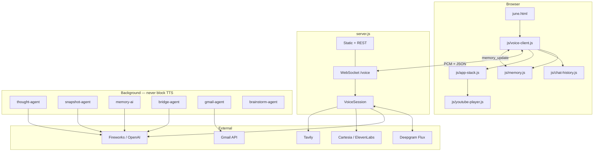
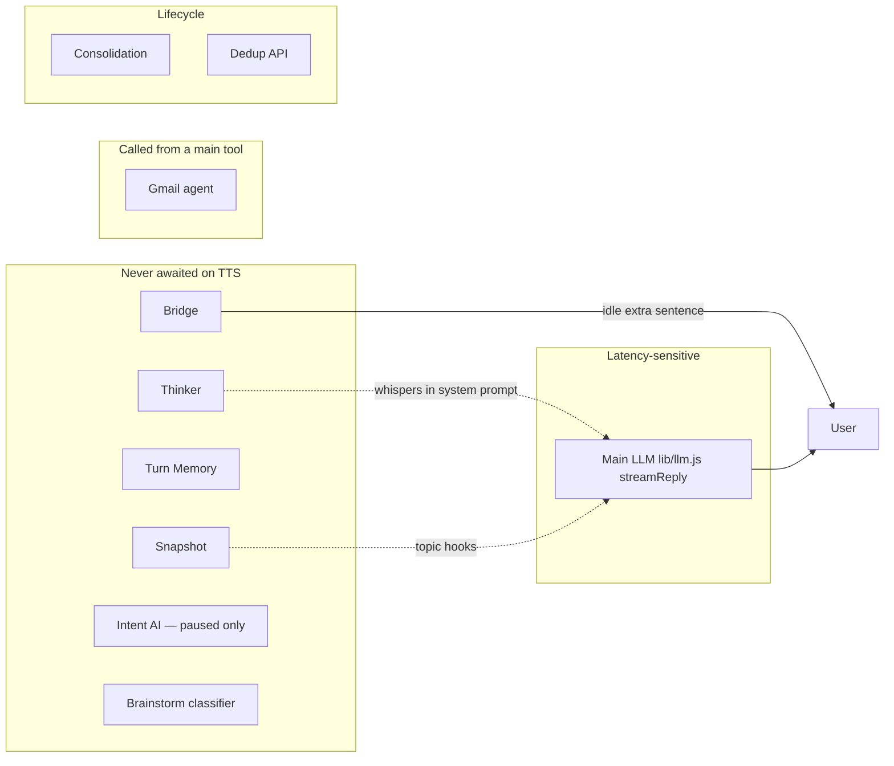

# June — Architecture (agent map)

This is the onboarding document for humans and Cursor agents. Read it before changing voice, memory, tools, or UI. Older notes in `md/Architecture-old.md`, root `PIPELINE.md`, and `md/PIPELINE.md` lag the code; **this file plus the source** are the source of truth.

June is an ultra-low-latency, full-duplex voice companion. The browser streams microphone PCM to a single-process Node server. The server runs Deepgram Flux STT, a streaming LLM (Fireworks or OpenAI Chat Completions), Cartesia/ElevenLabs TTS, and a set of **background agents that must never block the spoken path**. Memory and chat history live in the browser (`localStorage`). There is no database and no frontend bundler.

---

## How to use this document

| If you need to… | Jump to |
| --- | --- |
| Not break latency / personality | [Hard invariants](#hard-invariants) |
| Find a file | [Repository layout](#repository-layout) |
| Understand one spoken turn | [Voice pipeline](#voice-pipeline) |
| Add or change a tool | [Tool system](#tool-system) |
| Change what June says | [Personality and prompt assembly](#personality-and-prompt-assembly) |
| Change memory schema / recall | [Memory](#memory) |
| Change client UI / apps | [Browser](#browser) |
| See every WS/HTTP message | [Protocols](#protocols) |
| Know where to edit | [Where to change what](#where-to-change-what) |

---

## Hard invariants

These are product rules, not style nits. Violating them is a regression even if the feature “works.”

1. **Main voice path never waits on background AI.** Thinker, Snapshot, Memory Update, Bridge, Gmail sub-agent, brainstorm classification, and artifact saves run async. `streamReply()` in `lib/llm.js` is the only LLM that may delay spoken tokens, and even then Phase A should start speaking before tools finish (step mode).
2. **Do not special-case the user’s example.** If they say “June doesn’t search for AP Stats questions,” do not add `if (ap stats) search`. Fix the general tool policy / prompt / `tool_choice` so *any* live-info ask searches. Same for “don’t say huh / honestly” — change the character prompt or Thinker coaching, not a regex ban-list of those words.
3. **Prefer agents and tool descriptions over new keyword detectors.** Session sleep/pause/brainstorm phrases in `lib/functions.js` stay as hardcoded session commands. Do not add per-utterance `tool_choice` forcing on the main LLM — tools are always listed, `tool_choice` is `"auto"`, and the model decides.
4. **Barge-in must stay instant.** Abort LLM (`AbortController`), cancel TTS context, send `{ type: "interrupt", turnId }`, drop PCM tagged with that `turnId` on the client.
5. **Speculative LLM must not speak.** `EagerEndOfTurn` starts generation with TTS closed. TTS opens only on confirmed `EndOfTurn` with matching transcript, or a non-speculative turn.
6. **Tool chatter never reaches TTS/UI.** Only content deltas from `streamReply` are spoken. Tool JSON stays in the Chat Completions message list.
7. **Authoritative long-term memory is the browser.** Server mutates RAM, then pushes `{ type: "memory_update" }`. Client persists via `JuneMemory.applyFromServer()`.
8. **Server binds `127.0.0.1` only** (`server.js`). Default port is **`3010`** (`PORT` in `.env` / `lib/states.js`).

---

## Quick start

```bash
npm install
cp .env.example .env   # keys: FIREWORKS_API_KEY or OPENAI_API_KEY, DEEPGRAM_API_KEY, TTS keys
npm start              # http://127.0.0.1:3010
```

Open the page, click the orb (or press `m`) to start a voice session. `Ctrl/Cmd+Shift+G` opens the Agent Inspector.

| Key | Required for |
| --- | --- |
| `FIREWORKS_API_KEY` or `OPENAI_API_KEY` | Main LLM + all background agents (`LLM_PROVIDER=fireworks` default) |
| `DEEPGRAM_API_KEY` | STT |
| `CARTESIA_API_KEY` or `ELEVENLABS_API_KEY` | Server TTS (else browser `speechSynthesis`) |
| `TAVILY_API_KEY` | `web_search` |
| `GOOGLE_CLIENT_ID` + `GOOGLE_CLIENT_SECRET` | Gmail OAuth |

---

## Repository layout

```
June/
├── server.js                 # HTTP + static files + WebSocket /voice
├── june.html                 # Single-page UI (script order matters)
├── aichr_3.md                # LIVE character / system prompt (loaded by lib/states.js)
├── aichr_2.md, aichr_3-old.md  # Old personality drafts — not loaded
├── .env.example              # All env vars with comments
│
├── lib/                      # Server ES modules (Node ≥18.17)
│   ├── states.js             # State, FluxEvent, config, SYSTEM_PROMPT
│   ├── session.js            # VoiceSession — orchestrator (~2.9k lines)
│   ├── llm.js                # Main streaming LLM + prompt assembly + tool loop
│   ├── llm-client.js         # Shared OpenAI SDK client (Fireworks-compatible)
│   ├── model-options.js      # temperature vs reasoning_effort / max_tokens
│   ├── sttFlux.js            # Deepgram Flux WebSocket
│   ├── tts.js                # Cartesia WS + ElevenLabs WS/HTTP + gap PCM
│   ├── functions.js          # pause / resume / sleep / brainstorm phrase detectors
│   ├── memory-store.js       # Schema v3, normalize, upsert, scan/get
│   ├── memory.js             # Prompt builders, gap markers, rhythm, dry-utterance
│   ├── memory-tools.js       # scan_memory_category / get_memory_detail / past chats
│   ├── memory-ai.js          # Turn memory, intent, consolidate, dedupe
│   ├── thought-agent.js      # Thinker (background coach JSON)
│   ├── thinker-tools.js      # Thinker’s memory/past-chat/snapshot tools
│   ├── snapshot-agent.js     # Topic vibe + 10 hooks
│   ├── snapshot-tools.js     # check_snapshot_hooks for main LLM
│   ├── bridge-agent.js       # Idle continuation after June finishes speaking
│   ├── search-tools.js       # Tavily web_search + YouTube play-intent
│   ├── client-tools.js       # note list, clipboard, install_app, youtube_player_tool
│   ├── gmail-auth.js         # OAuth, .gmail-tokens.json
│   ├── gmail-tools.js        # Gmail function schemas + API wrappers
│   ├── gmail-agent.js        # Nested mail agent (search/read/send)
│   ├── brainstorm-agent.js   # Dictation classifier + formatter
│   ├── artifact-store.js     # Exact keepable docs (lists, emails, drafts)
│   ├── artifact-tools.js     # save_artifact / list_artifacts / get_artifact
│   ├── list-format.js        # Search reply cards + note-list markdown
│   ├── youtube-utils.js      # Parse IDs / thumbs / pick from search sources
│   ├── usage.js              # Token/cost tracker for inspector
│   └── debug-trace.js        # agent_trace payload builder
│
├── js/                       # Browser IIFEs — no bundler, load order in june.html
│   ├── index.js              # EMPTY placeholder (still loaded)
│   ├── ui.js                 # EMPTY, not loaded
│   ├── memory.js             # window.JuneMemory — localStorage june_memory
│   ├── artifacts.js          # window.JuneArtifacts — june_artifacts
│   ├── chat-history.js       # window.JuneChatHistory — june_saved_chats
│   ├── agent-inspector.js    # window.JuneAgentInspector
│   ├── youtube-player.js     # window.JuneYouTubePlayer — off-screen IFrame
│   ├── app-stack.js          # window.JuneAppStack — dock / Gmail / YouTube / Artifacts / brainstorm
│   └── voice-client.js       # Mic, WS, playback, chat UI, greeting
│
├── css/index.css
├── os.html, exp/             # Experimental 3D stack UI — not the live app
├── md/PIPELINE.md, md/STT-PIPELINE.md
└── Architecture.md           # This file
```

Script load order in `june.html` (do not reorder casually):

`index.js` → `memory.js` → `artifacts.js` → `chat-history.js` → `agent-inspector.js` → `youtube-player.js` → `app-stack.js` → `voice-client.js`

---

## High-level architecture


```mermaid
flowchart TB
  subgraph Browser
    HTML[june.html]
    VC[js/voice-client.js]
    MEM[js/memory.js]
    CH[js/chat-history.js]
    AS[js/app-stack.js]
    YT[js/youtube-player.js]
    HTML --> VC
    VC --> MEM
    VC --> CH
    VC --> AS
    AS --> YT
  end

  subgraph Server["server.js"]
    HTTP[Static + REST]
    WS["WebSocket /voice"]
    VS[VoiceSession]
    HTTP --- WS
    WS --> VS
  end

  subgraph Agents["Background — never block TTS"]
    Thinker[thought-agent]
    Snap[snapshot-agent]
    MemAI[memory-ai]
    Bridge[bridge-agent]
    Mail[gmail-agent]
    Brain[brainstorm-agent]
  end

  subgraph External
    DG[Deepgram Flux]
    LLM[Fireworks / OpenAI]
    TTS[Cartesia / ElevenLabs]
    Tav[Tavily]
    Gmail[Gmail API]
  end

  VC <-->|"PCM + JSON"| WS
  VS <--> DG
  VS --> LLM
  VS --> TTS
  Thinker --> LLM
  Snap --> LLM
  MemAI --> LLM
  Bridge --> LLM
  VS --> Tav
  Mail --> Gmail
  MEM <-->|"memory_update"| VC
```

**Process model:** one Node HTTP server, one `VoiceSession` per `/voice` socket. No workers, no Redis, no auth besides Gmail OAuth for mail.

---

## Data ownership

| Data | Authority | Transport |
| --- | --- | --- |
| Active conversation `history` | Server `VoiceSession.history` | Client keeps `clientHistory` for display only |
| Long-term memory (schema v3) | Browser `localStorage` key `june_memory` | `init.memory` up, `memory_update` down |
| Saved chats | Browser `june_saved_chats` (max 50) | `init.pastChats` up, `chat_saved` down |
| Installed virtual apps | Browser `june_installed_apps` + session `installedApps` Set | `app_install` down |
| Artifacts (exact docs) | Browser `june_artifacts` | `init.artifacts` up, `artifact_update` down |
| Gmail OAuth tokens | Server file `.gmail-tokens.json` (gitignored) | OAuth callback |
| TTS provider / ElevenLabs model | Client settings → WS | `set_tts_provider` / `set_tts_model` |
| Session cost / traces | Server RAM | `usage_update` / `agent_trace` |

On `init`, the client sends memory, timezone `context`, optional `history`, `pastChats`, TTS prefs, and `debug`. Localhost connections always enable debug tracing so the inspector ring-buffer is warm.

---

## Voice pipeline

```
Mic float32 @ device rate
  → AudioWorklet resample to Int16 @ 16 kHz (~80 ms chunks)
  → WS binary → FluxStream → Deepgram Flux
                              ↓ TurnInfo
                         VoiceSession.#onTurn
                              ↓ EagerEndOfTurn  → speculative streamReply, NO TTS
                              ↓ EndOfTurn       → confirm or restart; open TTS
                              ↓ streamReply Phase A (speech) / tools / Phase B
                              ↓ TTS PCM f32 @ 24 kHz
WS binary [uint32 LE turnId | PCM] → gapless playback (drop on interrupt)
```

### Speculative execution

Flux `EagerEndOfTurn` starts `streamReply` with `gen.speculative = true`. Tokens buffer; `#openTts` is skipped. If the later `EndOfTurn` transcript equals `gen.userText`, `#confirmGeneration()` opens TTS and flushes. If the user resumes (`TurnResumed`) or the final text differs, the draft is aborted.

### Barge-in

`StartOfTurn` while June is speaking: abort generation, cancel TTS, `{ type: "interrupt", turnId }`. Client ignores leftover PCM for that `turnId`. Follow-up (Bridge) and brainstorm generations abort immediately on any new speech; the main reply does not abort on `StartOfTurn` while already `SPEAKING` (Flux often fires that at true barge-in via a new turn — interrupt still happens through abort when a new generation starts).

Practical rule: **any new user turn aborts Bridge immediately** so idle add-ons never stack on the next reply.

### Step mode (in-turn tools)

`STEP_MODE_ENABLED` (default on). One TTS context stays open across tool rounds:

1. **Phase A** — model may speak immediately (reaction).
2. Tools start (`onToolsStarted` can kick Thinker/Snapshot). If Phase A was empty/murmur, June yields a searching-out-loud beat (`lemme see…` / `pulling that up…`) so TTS is not silent.
3. Optional mid-beat while Tavily / Gmail is still in flight (~1.5–3s).
4. `#awaitEnrichment(STEP_ENRICH_WAIT_MS)` (default 700ms) lets background snapshot/thinker catch up **without blocking first speech**.
5. **Phase B** — model continues with tool results on the same stream.

Max **3 tool rounds** (`MAX_TOOL_ROUNDS` in `lib/llm.js`). Round 3 has `tool_choice: "none"` (tools array still sent, so the prefix stays cacheable). Extra rounds cost nothing unless the model actually calls another tool.

Each round (the `step_continue` round after tools return most of all) is guarded by an idle watchdog (`MAIN_ROUND_IDLE_TIMEOUT_MS`, default 12000ms in `lib/states.js`). Any streamed chunk — content or tool-call delta — resets the clock; total silence from the provider for that long aborts just that round and speaks a short fallback (`STALL_FALLBACK_OPEN` / `STALL_FALLBACK_CONTINUE` in `lib/llm.js`) instead of leaving the turn stuck with tool results in hand but nothing spoken. Before this existed, a provider stall on the post-tool round had no bound — the turn could hang indefinitely with only a user barge-in able to recover it.

### Stall markers / gaps

The character prompt tells the model to insert `[gap N]` (`N` clamped 0.3–2.0 seconds). `mergeCleanDelta` / `parseSpeechSegments` in `lib/memory.js` strip markers from chat history. Silence is queued as `pendingSilenceSec` and prepended to the next TTS PCM via `makeSilencePcm()` in `lib/tts.js`. Chat UI hides markers unless Agent Inspector “Show stall markers” is on (`Ctrl/Cmd+Shift+G`).

TTS also inserts `{|chunk|}` debug markers at flush boundaries (`CHUNK_MARKER`) — display only, never sent to the TTS vendor.

### Idle Bridge (follow-up)

After a real assistant reply, `#armBridge` starts a silence timer (`FOLLOWUP_DELAY_MS` ≈ 1.7s + `FOLLOWUP_GRACE_MS`). In parallel, `#prefetchBridge` runs `runBridgeAgent` on **unused** Thinker whispers / snapshot hooks. If the user stays quiet, `#speakBridge` streams a short add-on (`gen.isFollowup`) and merges it into the last assistant history turn. Rate-limited (`FOLLOWUP_RATE_LIMIT_MS`). Aborted on any user speech.

`streamSnapshotFollowup` in `lib/llm.js` is a **leftover unused export**. Live idle speech is `lib/bridge-agent.js`.

---

## State machine

`lib/states.js` → `State`:

| State | Meaning |
| --- | --- |
| `IDLE` | No Flux connection |
| `LISTENING` | Mic open, waiting |
| `THINKING` | LLM streaming (may be speculative) |
| `SPEAKING` | TTS / fallback speech in flight |
| `PAUSED` | Ignore turns until resume (mic may still stream) |

Brainstorm is **not** a `State`. It is `VoiceSession.brainstorm.phase`: `off` | `capturing` | `wrapup`. Orb stays `LISTENING` while capturing.

```
IDLE → LISTENING → THINKING → SPEAKING → LISTENING
                       ▲                    │
                       └────────────────────┘  (next turn)
PAUSED overlays LISTENING/THINKING; sleep closes the socket after chat_saved.
```

---

## AI agent split

All of these may share the LLM vendor. Models are split in `config` so the **main spoken model stays expensive/fast** and background stays cheap (`gpt-oss-20b` on Fireworks, `gpt-4o-mini` on OpenAI).


```mermaid
flowchart LR
  subgraph Voice["Latency-sensitive"]
    Main[Main LLM lib/llm.js streamReply]
  end
  subgraph Async["Never awaited on TTS"]
    Thinker[Thinker]
    Snapshot[Snapshot]
    MemTurn[Turn Memory]
    Bridge[Bridge]
    Intent[Intent AI — paused only]
    BrainC[Brainstorm classifier]
  end
  subgraph Nested["Called from a main tool"]
    GmailA[Gmail agent]
  end
  subgraph Lifecycle
    Consol[Consolidation]
    Dedupe[Dedup API]
  end
  Thinker -.->|whispers in system prompt| Main
  Snapshot -.->|topic hooks| Main
  Bridge -->|idle extra sentence| User
  Main --> User
```

| Agent | File | Model env | When | Output |
| --- | --- | --- | --- | --- |
| Main | `lib/llm.js` | `OPENAI_MODEL` | Every confirmed/speculative turn | Spoken tokens + tool calls |
| Thinker | `lib/thought-agent.js` | `THOUGHT_AI_MODEL` | Debounced after turns (partials only if `BACKGROUND_AI_ON_PARTIALS`) | JSON whispers: tone, suggestions, `forceTools`, `memoryBridge` |
| Snapshot | `lib/snapshot-agent.js` | `SNAPSHOT_AI_MODEL` | Topic change, rate-limited | `{ hasTopic, topic, snapshot ≤80 chars, topicHooks[10] }` |
| Bridge / followup | `lib/bridge-agent.js` | `FOLLOWUP_MODEL` | After speech, user quiet | `{ continue, text, usedHook }` |
| Turn memory | `lib/memory-ai.js` `analyzeTurnMemory` | `MEMORY_AI_MODEL` | After assistant reply | Category upserts, chat title, pause/resume |
| Intent | `analyzeUserIntent` | same | **Only while paused** | pause/resume |
| Consolidation | `consolidateSessionMemory` | same | Socket close / sleep / `POST /api/consolidate` | Session summary + promote upserts |
| Dedup | `deduplicateMemories` | same | `POST /api/deduplicate` | Merge same-title sub_memories |
| Gmail | `lib/gmail-agent.js` | `GMAIL_AGENT_MODEL` | Main called `gmail_agent` | Nested search/read/send JSON |
| Brainstorm | `lib/brainstorm-agent.js` | `MEMORY_AI_MODEL` | Dictation mode | Classify action / format dump |
| Greeting | `generateGreeting` | main model | Page load `POST /api/greeting` | One spoken hello |

Disable flags: `MEMORY_AI_ENABLED`, `THOUGHT_AGENT_ENABLED`, `SNAPSHOT_AGENT_ENABLED`, `FOLLOWUP_ENABLED`, `BRAINSTORM_ENABLED`, `WEB_SEARCH_ENABLED`, `GMAIL_ENABLED`.

Thinker/Snapshot on every STT partial is **off by default** (`BACKGROUND_AI_ON_PARTIALS=false`) because it multiplied token spend.

---

## Personality and prompt assembly

**Live prompt file:** `aichr_3.md` → `SYSTEM_PROMPT` in `lib/states.js` (read once at process start; restart the server after edits).

`buildStaticSystem()` in `lib/llm.js` is built **once at import** and is the cacheable prefix. `buildLiveContext()` is rebuilt every turn and sent as a trailing system message (after history + the user turn):

1. `STATIC_SYSTEM` — `SYSTEM_PROMPT` (character) + memory-tool guidance + source switch + tool-truth + search/client/artifact/gmail/snapshot guides
2. Conversation `history` (append-only)
3. Current user turn
4. Live context — date/time, memory directory, past-chat/artifact indexes, installed apps, Gmail/YouTube session state, rhythm, engagement, Thinker whispers, snapshot hooks

The main Chat Completions call also sends `prompt_cache_key: "june-main-" + sessionId` and a **frozen** tools array (same JSON every request). Do not toggle tools or splice timestamps into the static prefix — that busts KV cache and shows up as 1–2s TTFT.

**Do not** put one-off “never say X” lists in `session.js`. Put speech style in `aichr_3.md`. Put next-turn coaching in Thinker. Put retrieval policy in tool descriptions.

---

## Tool system

Main LLM tools are a **frozen array** from `buildFrozenTools()` / `FROZEN_TOOLS` in `lib/llm.js`, built once at process start:

| Always | If configured at boot |
| --- | --- |
| `CLIENT_TOOLS` — `create_note_list`, `install_app`, `copy_to_clipboard`, `youtube_player_tool` | `SEARCH_TOOLS` if Tavily configured |
| `ARTIFACT_TOOLS` — `save_artifact`, `list_artifacts`, `get_artifact` | `GMAIL_TOOLS` if Gmail enabled |
| `MEMORY_TOOLS` + `PAST_CHAT_TOOLS` | |
| `SNAPSHOT_TOOLS` — `check_snapshot_hooks` (returns `not_ready` when empty) | |

`tool_choice` is `"auto"` on rounds 0–2 and `"none"` on round 3. Do not force a named function from a regex. Per-turn state (installed apps, Gmail connected, what’s playing) lives in live context; `install_app` returns `already_installed` rather than disappearing from the schema.

Retrieval policy is in tool descriptions + `buildSourceSwitchGuidance` + the tool-truth line: an action exists only if its tool returned ok. If a source misses, the model may switch (memory → web, mail → search) on a later round.

### Tool → client side effects

`runClientTool` / Gmail / YouTube execute on the **server**, then `VoiceSession` sends JSON the browser handles:

| Tool | Server send | Client |
| --- | --- | --- |
| `create_note_list` | `reply_cards` `{ kind: "note_list" }` + `artifact_update` | Chat card; saved to Artifacts exactly |
| `save_artifact` / auto-save | `artifact_update` | `JuneArtifacts.applyFromServer` + Artifacts app |
| `copy_to_clipboard` | `clipboard` | `navigator.clipboard.writeText` |
| `install_app` `gmail` | `app_install` + maybe `open_url` | `JuneAppStack.install` + OAuth tab |
| `youtube_player_tool` play | `youtube_play` | `JuneAppStack.playYouTube` → IFrame |
| pause/resume/stop | `youtube_control` | pause/resume/stop player |
| `web_search` | later `reply_cards` source tiles | App stack web cards |
| `gmail_agent` | via Gmail tools / `open_url` | Inbox pane if installed |

### Nested Gmail agent

`gmail_agent` is the default mail entry. `runGmailAgent` runs its own Chat Completions loop (max 6 rounds, 22s timeout) with `search_mail`, `read_mail`, `account_status`, `send_mail`. Search pages ~20 titles; if the mail is not there it keeps going with `page_token` up to **70** scanned. Direct `gmail_list_messages` / `gmail_read_message` / `gmail_send_email` still exist on the main model.

Gmail requires: (1) virtual app installed this session (`install_app`), (2) OAuth connected (`.gmail-tokens.json`). If not installed, June should offer download, not invent mail.

YouTube and Artifacts are **pre-installed** (`installedApps = new Set(["youtube", "artifacts"])`). Play with a song name: `web_search` `site:youtube.com` then `youtube_player_tool`.

---

## Module reference

### `server.js`

- Static file server; `/` → `june.html`. Path traversal blocked.
- REST: greeting, consolidate, deduplicate, memory stats, Gmail OAuth/inbox/send, format-list.
- `WebSocketServer` path `/voice`. Binary → `handleAudio`. JSON types: `init`, `text`, `resume`, `set_tts_provider`, `set_tts_model`, `set_debug`, `note_list_saved`.
- Localhost → `session.setDebugTracing(true)`.
- Listen `127.0.0.1`; `EADDRINUSE` exits with a hint (often Cursor Simple Browser).

### `lib/session.js` — `VoiceSession`

Central state machine. Owns Flux, TTS, `history`, `memory`, `gen`, Thinker/Snapshot/Bridge timers, `installedApps`, `lastSearch` / `lastNote` / `lastYouTube`, brainstorm blob, `SessionCostTracker`.

Important private methods:

| Method | Role |
| --- | --- |
| `#onTurn` | Flux events → barge-in / speculative / confirm |
| `#processUserTurn` | Sleep, brainstorm enter, pause, then `#beginGeneration` |
| `#beginGeneration` / `#consume` | AbortController + `streamReply` |
| `#emitDelta` / `#pushSpeechSegments` | Gap pacing + TTS send |
| `#finalize` | History, `assistant_done`, cards, memory sync, arm Bridge |
| `#syncMemoryToClient` | Immediate `memory_update`, then async `analyzeTurnMemory` |
| `#scheduleThought` / `#scheduleSnapshot` | Debounce + rate limit |
| `#armBridge` / `#prefetchBridge` / `#fireBridge` | Idle continuation |
| `#enterBrainstorm` / `#onBrainstormTurn` | Dictation capture |
| `#consolidateAndSend` | End-of-session chat save + memory promote |
| `#trace` | `agent_trace` (always for tools/brainstorm; else debug only) |

Generation object (`this.gen`): `id`, `userText`, `speculative`, `abort`, speech buffers, `ttsCtl`, `searchSources`, flags `isFollowup` / `isBrainstorm`.

### `lib/llm.js`

- `streamReply` — async generator, tool loop, step-mode beats, live snapshot/thought getters.
- `generateGreeting` — page-load hello (also `/api/greeting`).
- Prompt builders: `buildThoughtHints`, `buildSnapshotContext`, `buildStaticSystem`, `buildLiveContext`.
- Echo fallback if no API key: `"I'm not fully wired up yet, but I heard you say: …"`.

### `lib/llm-client.js`

One cached `OpenAI` SDK instance. Fireworks: `baseURL` `https://api.fireworks.ai/inference/v1`.

### `lib/sttFlux.js` — `FluxStream`

`wss://api.deepgram.com/v2/listen`, model `flux-general-multi` (or `flux-general-en`). linear16 @ 16 kHz. Pre-buffers until socket open. On multilingual, after `STT_LANGUAGE_LOCK_AFTER` consecutive same-language `EndOfTurn`s, lock `language_hint`. Emits `turn` with `FluxEvent` types.

### `lib/tts.js`

- `createTTS(provider)` → `CartesiaTTS` | `ElevenLabsTTS` | `null` (browser).
- ElevenLabs **Flash** = WebSocket; **`eleven_v3`** = HTTP stream (higher latency).
- Context id `gen-{turnId}`. `cancel` drops the context.

### `lib/functions.js`

Hardcoded session commands (intentionally not LLM):

- Sleep: `go to sleep` / `go sleep`
- Brainstorm: `enter brainstorm mode` / `exit brainstorm mode` (STT may split “brain storm”)
- Pause/resume: short phrases, **suppressed** if the utterance is about music/YouTube (so “pause the song” hits the player, not session pause)

### `lib/memory-store.js`

Schema **v3**, `system_id: "gemma_core_memory"`. Default categories: `general_info`, `interests`, `media`, `work_life`, `topic_deep_dives`. Dynamic snake_case categories allowed. Each category: `{ title, description, sub_memories[] }` with `{ id, title, timestamp, content, recallScore }`. Cap `MAX_SUB_MEMORIES_PER_CATEGORY` (60). Migrates v1/v2 on `normalizeMemory`.

### `lib/memory.js`

Prompt blocks, `[gap N]` parsing, dry-utterance / rhythm / opener rotation, `applyCategoryUpdates` re-export, session meta `consolidateSession` / `startNewSession`. Old token-budget retrieval is a no-op stub (`retrieveRelevantMemories`).

### `lib/memory-ai.js`

JSON memory agent with optional `list_past_chats` / `get_past_chat`. Writes facts the **memory agent** decides — session does not skip extraction just because rhythm labeled the turn “dry.” `shouldSkipMemoryAnalysis` still skips trivial noise.

### `lib/search-tools.js`

Tavily POST, 8s timeout, 5 min query cache. `detectExplicitSearch` / `detectYouTubePlayIntent` force tools. Results include titles, URLs, snippets; `pickYouTubeFromSources` for play-from-search.

### `lib/list-format.js`

`shouldOfferNoteList` — only multi-item keepable recs (food/spots/events), not weather/scores. `buildSearchReplyCards` → source tiles + optional list offer. `formatNoteList` used by tool + `POST /api/format-list`.

### `lib/usage.js` / `lib/debug-trace.js`

Inspector cost panel (OpenAI + Fireworks list prices) and `{ type: "agent_trace", agent, phase, name, detail, durationMs, turnId }`.

---

## Browser

### `js/voice-client.js` — `window.JuneVoice`

- `getUserMedia` with echoCancellation / noiseSuppression / AGC.
- AudioWorklet capture → 16 kHz Int16 → binary WS.
- JSON handler (`switch (msg.type)`).
- Gapless 24 kHz playback; `turnId` header; interrupt flush.
- Orb click / `m`: start / stop / resume. Mute button gates mic send.
- Text bar → `{ type: "text" }` (bypasses STT).
- `loadGreeting()` via `/api/greeting` using memory + last chat + timezone.
- Persist chat on `beforeunload` / `pagehide`.

### `js/memory.js` — `window.JuneMemory`

Mirrors server schema. Key `june_memory`. `load`, `save`, `applyFromServer`, `startSession`, `getStorageStats`.

### `js/chat-history.js` — `window.JuneChatHistory`

Key `june_saved_chats`. `save` / `list` / `get` / `remove`. Records include `session_id`, `title`, `main_summary`, `chats[]`, `extracted_context`.

### `js/app-stack.js` — `window.JuneAppStack`

3D dock inside `.voice`. Catalog: Memory / Web / Chats (base), **YouTube** (persistent), **Artifacts** (persistent, exact docs), **Gmail** (installable), brainstorm overlay. API: `install`, `playYouTube`, `pauseYouTube`, `setBrainstorm`, `setArtifacts`, `showArtifacts`, `reset`, `setCards`.

### `js/youtube-player.js` — `window.JuneYouTubePlayer`

Hidden IFrame API player. `warmup` on page load so first play is fast. `load` / `pause` / `resume` / `stop` / `parseId`.

### `js/agent-inspector.js`

`Ctrl/Cmd+Shift+G`. Filters: main / thinker / snapshot / memory / followup. Cost breakdown. Stall checkbox. Sends `set_debug`.

### `css/index.css`

All live styling. External `https://lcnjoel.com/css/standard.css` is also linked from `june.html`.

---

## Protocols

### Client → server JSON (`/voice`)

| `type` | Payload | Action |
| --- | --- | --- |
| `init` | `memory`, `context`, `history?`, `pastChats?`, `artifacts?`, `ttsProvider?`, `elevenLabsModel?`, `debug?` | Bind session |
| `text` | `text` | Typed turn (or brainstorm dump) |
| `resume` | — | Unpause |
| `set_tts_provider` | `provider`: `elevenlabs` \| `cartesia` \| `browser` | Recreate TTS |
| `set_tts_model` | `model` | ElevenLabs model |
| `set_debug` | `enabled` | Inspector traces (localhost cannot turn off) |
| `note_list_saved` | `title`, `markdown` | Remember last note for clipboard |

Binary: raw Int16 PCM @ 16 kHz.

### Server → client JSON

| `type` | Purpose |
| --- | --- |
| `ready` | capabilities, TTS provider lists, ElevenLabs models |
| `state` | `IDLE` / `LISTENING` / `THINKING` / `SPEAKING` / `PAUSED` |
| `transcript` | User partial/final |
| `assistant_delta` | Streaming text (`text`, `textWithStalls`, `turnId`) |
| `assistant_done` | Turn complete; `speakFallback` if browser TTS; `continuation` if Bridge |
| `memory_update` | Full memory object |
| `artifact_update` | Full artifacts store + optional `focusId` |
| `chat_saved` | Sidebar record |
| `function` | `pause` / `resume` / `sleep` |
| `interrupt` | Drop `turnId` audio |
| `tts_provider` / `tts_model` | Confirm settings |
| `reply_cards` | Search tiles, note lists, list offers |
| `clipboard` | Text to copy |
| `app_install` | `appId` (gmail) |
| `open_url` | OAuth or external link |
| `youtube_play` / `youtube_control` | Player |
| `brainstorm` | `{ phase, dump, title, body }` |
| `agent_trace` | Inspector row |
| `usage_update` | Session cost |
| `error` | `{ source, message }` |

Binary:

```
[uint32 LE turnId][float32 PCM @ 24 kHz]
```

### HTTP

| Method | Path | Purpose |
| --- | --- | --- |
| `POST` | `/api/greeting` | Opening line from memory + last chat + timezone |
| `POST` | `/api/consolidate` | Session-end upserts |
| `POST` | `/api/deduplicate` | Merge duplicate sub_memories |
| `GET` | `/api/memory/stats` | Schema + two-step retrieval metadata |
| `POST` | `/api/format-list` | Format note list markdown |
| `GET` | `/api/gmail/auth` | Redirect to Google OAuth |
| `GET` | `/api/gmail/callback` | Code exchange → `.gmail-tokens.json` |
| `GET` | `/api/gmail/status` | configured / connected / email |
| `GET` | `/api/gmail/inbox` | List messages (`q`, `max`) |
| `POST` | `/api/gmail/send` | `{ to, subject, body, cc }` |
| `GET` | `/` | `june.html` |

Gmail redirect URI must be exactly `http://localhost:3010/api/gmail/callback` (or `GMAIL_REDIRECT_URI`).

---

## Memory

Two-step retrieval (when tools are on):

1. `scan_memory_category` — titles only
2. `get_memory_detail` — one sub-memory body

`general_info` is always inlined into the system prompt. Everything else is explore-via-tools.

Per-turn `analyzeTurnMemory` may add `generalInfo`, `categorized` (category + title + content), `corrections`, `chatTitle`, `chatSummaryHint`. Applied with `applyCategoryUpdates`.

On close/sleep: if `turnCount >= CONSOLIDATE_MIN_TURNS` (default 3), consolidation LLM may promote lasting facts. Chat is still saved immediately (`chat_saved`) so the sidebar does not wait on that LLM.

Client and server schemas must stay in sync (`js/memory.js` vs `lib/memory-store.js`).

---

## Brainstorm / dictation

Trigger: spoken or typed **enter brainstorm mode**. Session stops auto-replies, appends STT finals into a dump, classifier (`classifyBrainstormTurn`) decides `content` / `exit` / wrapup actions (`format`, `tweak`, `copy`, `speak`, `done`). Formatter (`formatBrainstormDump`) produces title/body/clipboardText and auto-saves that exact text to Artifacts. UI: `brainstorm` WS events → `JuneAppStack.setBrainstorm`. Exit: **exit brainstorm mode** or wrapup `done`. Sleep still consolidates.

Do not infer brainstorm from “write me an email” in normal chat — that is a normal turn (or Gmail send). Mode is an explicit session switch.

---

## Artifacts

Exact keepable documents (lists, emails, formatted drafts). Browser `localStorage` key `june_artifacts` is authoritative. Server holds a RAM copy for tools.

**Write (not the spoken model’s job to remember):** `create_note_list` and brainstorm format auto-save the exact body. `save_artifact` is for when they ask to keep an email or other wording word-for-word. Do not rewrite the body.

**Read:** titles sit in the system prompt (index only). `get_artifact` returns the stored body. June must use that text verbatim — never rephrase, summarize, or polish.

Dock app: four-dot constellation (top, left, right, bottom). Tap a card for the exact document. Copy is available in the pane.

---

## Configuration

Canonical defaults live in `lib/states.js`. `.env.example` documents them. Highlights:

| Variable | Default | Role |
| --- | --- | --- |
| `PORT` | `3010` | HTTP |
| `LLM_PROVIDER` | `fireworks` | `fireworks` \| `openai` |
| `OPENAI_MODEL` | Nemotron 3 Ultra / `gpt-4.1-mini` | Main spoken model |
| `MAIN_TEMPERATURE` | `0.56` in code (`0.76` in example) | Main temperature |
| `FOLLOWUP_MODEL` | gpt-oss-120b / gpt-4o-mini | Bridge |
| `MEMORY_AI_MODEL` / `THOUGHT_AI_MODEL` / `SNAPSHOT_AI_MODEL` | cheap 20b / gpt-4o-mini | Background |
| `STEP_MODE_ENABLED` | true | Speak-then-tools |
| `STEP_ENRICH_WAIT_MS` | 700 | Max wait for live snapshot/thought mid-turn |
| `MAIN_ROUND_IDLE_TIMEOUT_MS` | 12000 | Abort a stalled tool-loop round (no chunk this long) and speak a fallback |
| `TTS_PROVIDER` | `cartesia` in code, `elevenlabs` in example | Default TTS |
| `STT_MODEL` | `flux-general-multi` | Flux |
| `EAGER_EOT_THRESHOLD` / `EOT_THRESHOLD` / `EOT_TIMEOUT_MS` | 0.5 / 0.7 / 3000 | Turn endpointing |
| `THOUGHT_DEBOUNCE_MS` / `THOUGHT_RATE_LIMIT_MS` | 1500 / 12000 | Thinker spend |
| `SNAPSHOT_*` | 2000 / 10000 / 180000 | Snapshot spend / TTL |
| `FOLLOWUP_DELAY_MS` / `FOLLOWUP_RATE_LIMIT_MS` | 1700 / 25000 | Bridge |
| `CONSOLIDATE_MIN_TURNS` | 3 | Skip tiny-chat consolidation LLM |
| `MEMORY_TOKEN_BUDGET` | 400 in code | Legacy budget (tools replaced retrieval) |

`chatModelOptions` strips `temperature` for o-series; sets `reasoning_effort` for gpt-oss.

---

## Graceful degradation

| Missing | Behavior |
| --- | --- |
| No Deepgram | STT errors to client |
| No LLM key | Echo fallback; no background agents |
| No Cartesia/ElevenLabs | `speakFallback` → browser `speechSynthesis` |
| No Tavily | `web_search` omitted from tools |
| No Gmail OAuth | Tools return `not_connected`; UI “Connect Gmail” |
| Brainstorm off | Enter command ignored |

---

## Where to change what

| Goal | Start here |
| --- | --- |
| Personality, fillers, gap markers, banned closers | `aichr_3.md` then restart Node |
| Per-turn clause shape / dry-streak behavior | `lib/memory.js` (`pickTurnSyntax`, `buildConversationRhythm`) |
| Latency, barge-in, speculative TTS, Bridge timing | `lib/session.js`, `lib/sttFlux.js` |
| What tools exist / `tool_choice` / source switch | `lib/llm.js` `FROZEN_TOOLS` + `streamReply` + `buildSourceSwitchGuidance` |
| Search policy | `lib/search-tools.js` descriptions + `detectExplicitSearch` |
| Memory writes | `lib/memory-ai.js`, `lib/memory-store.js` |
| Thinker coaching | `lib/thought-agent.js` `THINKER_PROMPT` |
| Topic hooks | `lib/snapshot-agent.js` `SNAPSHOT_PROMPT` |
| Idle extra sentence | `lib/bridge-agent.js` |
| Gmail behavior | `lib/gmail-agent.js` then `lib/gmail-tools.js` |
| Virtual apps / dock animation | `js/app-stack.js`, `june.html` `.app-stack` |
| Artifacts (exact lists/emails/drafts) | `lib/artifact-store.js`, `lib/artifact-tools.js`, `js/artifacts.js` |
| Mic / playback / WS client | `js/voice-client.js` |
| Memory persistence | `js/memory.js` **and** `lib/memory-store.js` |
| New REST route | `server.js` |
| Models, flags, ports | `lib/states.js` + `.env.example` |
| Inspector | `js/agent-inspector.js`, `lib/debug-trace.js`, `lib/usage.js` |

---

## Working in this repo (for Cursor agents)

- **ES modules**, `"type": "module"`. No TypeScript, no tests, no bundler.
- Frontend is IIFEs on `window.*`. Do not `import` in `js/`.
- Keep server files focused; `session.js` is already the orchestrator — new product surface usually belongs in a `lib/*-agent.js` or `*-tools.js`, not more inline heuristics in `#processUserTurn`.
- Never commit `.env` or `.gmail-tokens.json`.
- Restart `npm start` after `aichr_3.md` or `lib/states.js` changes (`SYSTEM_PROMPT` is read at import time).
- Ignore `.cursor/rules/web.mdc` for this project (it describes Next.js/Supabase; June is not that stack).
- Experimental / non-runtime: `os.html`, `exp/`, `hate.js`, `leak.md`, empty `js/index.js` / `js/ui.js`, `aichr_2.md`.
- Voice pipeline deep dives (partially stale): `md/PIPELINE.md`, `md/STT-PIPELINE.md`.
- Product constraint recap is also in `cursor.md` (no example-fitted heuristics, do not add main-path latency).

---

## Dependencies

| Package | Use |
| --- | --- |
| `dotenv` | `.env` |
| `openai` | Chat Completions for every agent (Fireworks-compatible) |
| `ws` | `/voice` + Flux + Cartesia/ElevenLabs sockets |
| `googleapis` | Gmail OAuth + API |

No React, no DB, no queue. Single Node process.
